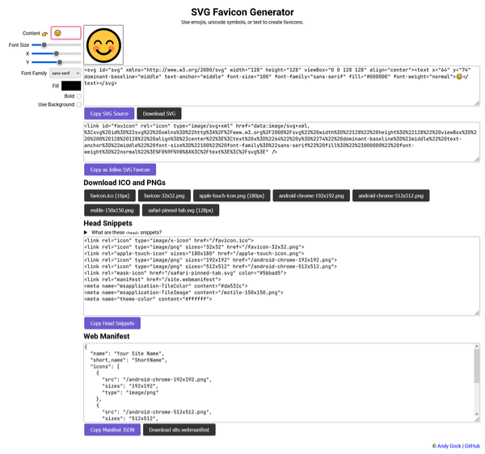

# SVG Favicon Generator

This is a Vanilla JS web application that allows users to create and customize SVG favicons. Users can input text, adjust font size, position, font family, fill color, and background shape and color. The generated SVG can be downloaded or copied to the clipboard.

## Features

- Input text, emoji, or unicode symbol for the favicon
- Adjust font size, position (X and Y coordinates)
- Select font family (Sans-serif, Serif, Monospace)
- Choose text color
- Toggle bold text
- Enable and customize background (rectangle or circle, with color)
- Download the generated SVG
- Copy the SVG source to the clipboard
- Copy as inline SVG favicon link
- Download ICO and PNG files in multiple sizes (16x16, 32x32, 180x180, 192x192, 512x512, 150x150)
- Download Safari pinned tab SVG
- Copy all recommended `<head>` favicon and manifest snippets
- View and copy a ready-to-use web manifest (site.webmanifest)
- Download the web manifest JSON

## Usage

1. Open the application in a web browser.
2. Use the controls to customize the favicon:
   - Enter text in the "Content" input field.
   - Adjust the font size, position, font family, and fill color.
   - Toggle bold text using the checkbox.
   - Enable background and choose shape and color if needed.
3. The generated SVG will be displayed in the preview area.
4. Click "Download" to save the SVG file or "Copy SVG source" to copy the SVG code to the clipboard.

## License

This project is licensed under the MIT License. See the [LICENSE](LICENSE) file for details.

## Author

- Andy Gock

## Links

- [Demo](https://svg.gock.net/)
- [GitHub Repository](https://github.com/andygock/svg-favicon-generator/)
- [Author's Website](https://gock.net/)
